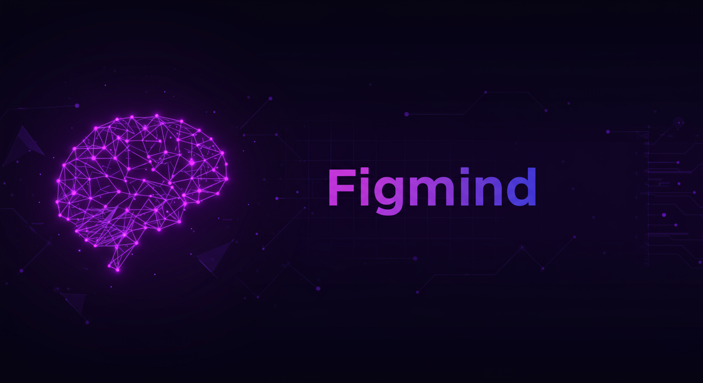

<div align="center">
  

  <br/>
  <br/>

  [](https://www.npmjs.com/package/figmind)
  [](https://www.npmjs.com/package/figmind)
  [](./LICENSE)
  [](https://nodejs.org)
  [](https://modelcontextprotocol.io)

  <br/>

  **Give your AI the ability to think in Figma.**

  figmind connects any MCP-compatible AI client to Figma — letting it read, create, and modify designs in real time using natural language.

  <br/>

  [Getting Started](#getting-started) · [Available Tools](#available-tools) · [Architecture](#architecture) · [Contributing](#contributing)

  <br/>
</div>

---

## How it works

```
Your AI  ←—— MCP ——→  figmind server  ←—— WebSocket ——→  Figma Plugin  ←——→  Canvas
```

figmind runs a local MCP server your AI can call. A companion Figma plugin bridges the WebSocket connection directly to your open file. All traffic stays on your machine — no cloud relay, no third-party API.

---

## Getting Started

### Requirements

- [Node.js](https://nodejs.org/) 20+
- [Cursor](https://cursor.com/) or any [MCP-compatible](https://modelcontextprotocol.io) AI client
- Figma Desktop *(web version does not support local plugins)*

---

### Step 1 — Configure your MCP client

Open `~/.cursor/mcp.json` and add:

```json
{
  "mcpServers": {
    "figmind": {
      "command": "npx",
      "args": ["--yes", "figmind@latest"]
    }
  }
}
```

| OS | Config path |
|---|---|
| macOS | `~/.cursor/mcp.json` |
| Windows | `%APPDATA%\Cursor\mcp.json` |
| Linux | `~/.config/Cursor/mcp.json` |

Restart Cursor. The first run downloads figmind automatically (~5 seconds).

> **Using comment tools?** Add your Figma personal access token:
> ```json
> "env": { "FIGMA_TOKEN": "your-figma-personal-access-token" }
> ```
> Generate one at **Figma → Account Settings → Security → Personal access tokens**.

---

### Step 2 — Install the Figma plugin

1. Clone this repository
2. Run `yarn install && yarn build:plugin`
3. Open any file in **Figma Desktop**
4. Go to **Plugins → Development → Import plugin from manifest**
5. Select `packages/figma-plugin/manifest.json`
6. Run **Figma MCP Bridge** — the indicator turns green when connected

---

### Step 3 — Start designing with AI

With the plugin running and Cursor open, just ask:

```
Create a frame called "Hero" — 1440×900, centered on the canvas
Add a text node "Welcome back" at x:80, y:120, 32px Inter bold
List all color variable collections in this file
Apply the variable "color/primary" to the fills of node [id]
Create a mobile login screen with email and password fields
Review the design of the screen with node id [id] and fix spacing issues
Generate a 5-screen onboarding flow for a fitness app
```

---

## Available Tools

### Canvas

| Tool | Description |
|---|---|
| `create_frame` | Creates a new frame on the canvas |
| `create_text` | Creates a text node |
| `create_from_html` | Builds a node tree from HTML/CSS markup |
| `get_file_context` | Returns a summary of the current file |
| `get_page_components` | Lists all components on the current page |

### Nodes

| Tool | Description |
|---|---|
| `get_node` | Returns a node's full data by ID |
| `get_children` | Lists a node's direct children |
| `get_full_tree` | Returns the full subtree of a node |
| `find_nodes` | Searches nodes by name or type |
| `set_node_property` | Updates position, size, fills, strokes, opacity, and more |
| `move_node` | Moves a node to a different parent |
| `delete_node` | Removes a node |

### Components

| Tool | Description |
|---|---|
| `create_component_instance` | Instantiates a published component by key |
| `swap_component` | Swaps a component instance to a different master |

### Design

| Tool | Description |
|---|---|
| `get_design_system_kit` | Returns fonts, colors, and tokens from the file |
| `get_all_used_styles` | Lists all styles used in the document |
| `get_available_fonts` | Lists all available fonts |

### Variables

| Tool | Description |
|---|---|
| `get_variable_collections` | Lists all variable collections |
| `get_variables` | Lists variables, optionally filtered by collection |
| `apply_variable_to_node` | Binds a variable to a node property |
| `get_library_variables` | Lists variables from connected libraries |

### Prototype

| Tool | Description |
|---|---|
| `set_reactions` | Sets prototype reactions (links, animations) on a node |

### Export

| Tool | Description |
|---|---|
| `export_node` | Exports a node as an image (returns base64) |
| `export_batch` | Exports multiple nodes at once |
| `export_page` | Exports the full page |

### Comments *(requires `FIGMA_TOKEN`)*

| Tool | Description |
|---|---|
| `create_comment` | Creates a comment on the file |
| `get_comments` | Lists all comments on the file |

---

## Built-in Prompts

figmind ships with three ready-to-use prompts:

| Prompt | Description |
|---|---|
| `create-screen` | Generate a mobile screen following the project design system |
| `review-screen` | Review a screen for design issues and layout problems |
| `create-flow` | Generate a full multi-screen user flow for a feature |

---

## Architecture

```
packages/
├── mcp-server/      # Node.js — published to npm as figmind
│   └── src/
│       ├── index.ts        # Entry point (stdio transport)
│       ├── mcp.ts          # Server factory, registers all tools
│       ├── bridge.ts       # WebSocket bridge to Figma plugin
│       ├── prompts.ts      # Built-in prompts
│       └── tools/          # All MCP tool implementations
└── figma-plugin/    # Figma plugin — bridges commands to the canvas
    └── src/
        ├── code.ts         # Plugin main: executes all Figma API commands
        └── ui/ui.html      # Plugin UI (connection status indicator)
```

figmind uses the [Model Context Protocol SDK](https://github.com/modelcontextprotocol/typescript-sdk) over stdio, which means it works with any MCP-compatible client — not just Cursor.

---

## Contributing

Contributions are very welcome! Here's how to get started:

```bash
git clone https://github.com/guhcostan/figma-mcp-bridge.git
cd figma-mcp-bridge
yarn install
yarn dev   # starts both the MCP server (watch mode) and plugin bundler
```

Running tests:

```bash
yarn test
```

### Adding a new tool

1. Create your tool in `packages/mcp-server/src/tools/`
2. Register it in `packages/mcp-server/src/mcp.ts`
3. Handle the command in `packages/figma-plugin/src/code.ts`
4. Add tests in `packages/mcp-server/src/tools/__tests__/`

---

## Publishing a New Version

Bump the version in `packages/mcp-server/package.json`, then:

```bash
git tag v1.0.1
git push --tags
```

GitHub Actions publishes to npm automatically on any `v*` tag.

---

## License

[MIT](./LICENSE) © [Gustavo Costa](https://github.com/guhcostan)
